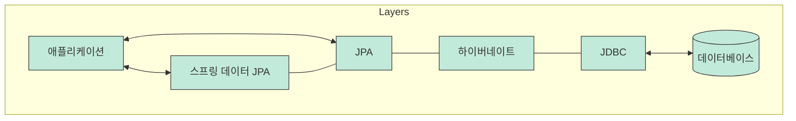

# 05장 데이터베이스와 JPA 이해하기

---

## 5.1 데이터베이스란?

### 데이터베이스(DB)
* 데이터를 저장하고 관리하는 공간
* 애플리케이션은 DB에 데이터를 저장/조회함

### RDBMS
* 테이블 형태로 데이터를 저장하는 관계형 데이터베이스
- 행(Row)과 열(Column) 구조 사용
- 예시 테이블


    | id | name |
    | --- | --- |
    | 1 | kim |
    | 2 | lee |


### H2 atabase
* 스프링 부트에서 자주 사용하는 인메모리 DB
* 프로그램 종료 시 데이터가 초기화됨

### MySQL
* 대표적인 관계형 데이터베이스(RDBMS)
* 실제 서비스 환경에서 많이 사용

### 자주 사용하는 SQL
| SQL      | 역할    |
| -------- | ----- |
| `SELECT` | 조회    |
| `INSERT` | 저장    |
| `UPDATE` | 수정    |
| `DELETE` | 삭제    |
| `WHERE`  | 조건 지정 |

```sql id="q3ly6p"
SELECT * FROM member WHERE id = 1;
```

---

## 5.2 ORM이란?

### ORM
* 객체(Object)와 데이터베이스(DB)를 연결하는 기술
* 자바 객체를 통해 DB를 다룰 수 있게 해줌
* "객체 ↔ 테이블 자동 연결"

### ORM 사용 이유

- 기존 방식

    ```
    자바 코드 → 직접 SQL 작성 → DB 실행
    ```

- ORM 방식

    ```
    자바 객체 → ORM → DB 처리
    ```

### ORM 장점
| 장점       | 설명                        |
| -------- | ------------------------- |
| SQL 감소   | SQL을 직접 많이 작성하지 않아도 됨     |
| 객체지향 개발  | 자바 코드 중심 개발 가능            |
| DB 변경 유리 | MySQL → PostgreSQL 변경이 쉬움 |
| 유지보수 편리  | 매핑 구조가 명확                 |

### ORM 단점
| 단점        | 설명                |
| --------- | ----------------- |
| 학습 난이도    | 프로젝트가 커질수록 어려움    |
| 복잡한 쿼리 한계 | 매우 복잡한 SQL 처리 어려움 |

---

## 5.3 JPA와 하이버네이트

### 전체 구조 이해



### JPA
* 자바에서 DB를 사용하는 방법을 정의한 인터페이스
* 객체와 DB를 연결하는 표준 기술
* "자바 ORM 사용 규칙"

### Hibernate
* JPA를 실제로 구현한 ORM 프레임워크
* 내부적으로 JDBC 사용
* "JPA의 실제 구현체"

### JDBC
* 자바에서 DB에 직접 연결하는 기술
* SQL 실행 기능 제공


### 스프링 데이터 JPA
* JPA를 더 쉽게 사용할 수 있게 도와주는 기술
* Repository 코드가 매우 간단해짐
```java
public interface MemberRepository
        extends JpaRepository<Member, Long> {
}
```

### 엔티티(Entity)
* DB 테이블과 연결되는 자바 객체
* 보통 `@Entity` 사용
```java
@Entity
public class Member {

    @Id
    private Long id;

    private String name;
}
```

### 엔티티 매니저(EntityManager)
- 엔티티를 저장, 조회, 수정하는 객체
- JPA 핵심 객체
- 사용 방식

    ```java
    @Autowired
    EntityManager em;
    ```

  또는

    ```java
    @PersistenceContext
    EntityManager em;
    ```

### 영속성 컨텍스트
* 엔티티를 관리하는 가상 저장 공간
* EntityManager 내부에서 동작

-  핵심 기능

| 기능    | 설명                |
| ----- | ----------------- |
| 1차 캐시 | 같은 객체 재조회 시 성능 향상 |
| 쓰기 지연 | SQL 실행을 모아서 처리    |
| 변경 감지 | 수정된 객체 자동 반영      |
| 지연 로딩 | 필요한 시점에 조회        |


### 변경 감지 예제
```java
Member member = em.find(Member.class, 1L);

member.setName("kim");
```
* 별도 update SQL 없이 변경 내용 감지 가능


### 프록시 엔티티
* 실제 객체 대신 사용하는 가짜 객체
* 지연 로딩에서 사용됨
* 실제 데이터가 필요할 때 DB 조회

### 엔티티 상태
| 상태     | 설명           |
| ------ | ------------ |
| 비영속    | 아직 DB와 관계 없음 |
| 영속(관리) | JPA가 관리 중    |
| 분리     | 관리 대상에서 제외   |
| 삭제     | 삭제 예정 상태     |


### 상태 흐름
비영속 → 영속 → 분리 → 삭제

---

## 5.4 스프링 데이터와 스프링 데이터 JPA

### 스프링 데이터
* 데이터 접근 기술을 쉽게 사용할 수 있게 지원하는 프로젝트

### 스프링 데이터 JPA
* JPA 기반 Repository 기능 제공
* CRUD 코드 자동 생성 가능

### CRUD
| 기능     | 설명 |
| ------ | -- |
| Create | 저장 |
| Read   | 조회 |
| Update | 수정 |
| Delete | 삭제 |


## 5.5 예제 코드 살펴보기

### JpaRepository
* 기본 CRUD 기능 제공 인터페이스
```java
public interface MemberRepository
        extends JpaRepository<Member, Long> {
}
```

### 자동 제공 기능
```text
save()
findById()
findAll()
delete()
```

---

## 헷갈리는 개념 정리
### 1. JPA vs Hibernate
| 개념        | 역할           |
| --------- | ------------ |
| JPA       | ORM 표준 인터페이스 |
| Hibernate | JPA 구현체      |
* JPA = 규칙
* Hibernate = 실제 동작 코드

### 2. JDBC vs JPA
| 개념   | 특징        |
| ---- | --------- |
| JDBC | SQL 직접 작성 |
| JPA  | 객체 중심 개발  |

### 3. Entity vs Table
| 개념     | 설명     |
| ------ | ------ |
| Entity | 자바 객체  |
| Table  | DB 테이블 |

### 4. H2 vs MySQL
| 개념    | 특징           |
| ----- | ------------ |
| H2    | 테스트용 인메모리 DB |
| MySQL | 실제 서비스용 DB   |

### 5. 영속성 컨텍스트 vs DB
| 개념       | 역할           |
| -------- | ------------ |
| 영속성 컨텍스트 | 엔티티 관리 공간    |
| DB       | 실제 데이터 저장 공간 |

---

## 핵심 요약
* DB = 데이터 저장소
* RDBMS = 테이블 기반 DB
* H2 = 테스트용 DB
* MySQL = 실제 서비스 DB
* ORM = 객체와 DB 연결 기술
* JPA = ORM 표준
* Hibernate = JPA 구현체
* JDBC = DB 연결 기술
* Entity = 테이블과 연결된 객체
* EntityManager = 엔티티 관리 객체
* 영속성 컨텍스트 = 엔티티 관리 공간
* JpaRepository = CRUD 자동 지원
